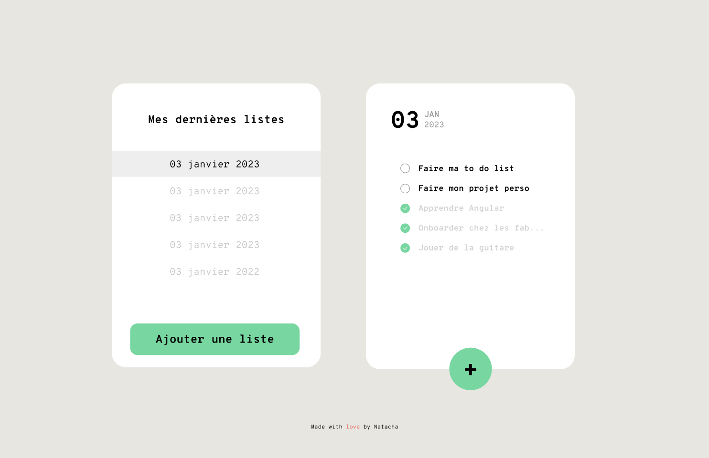
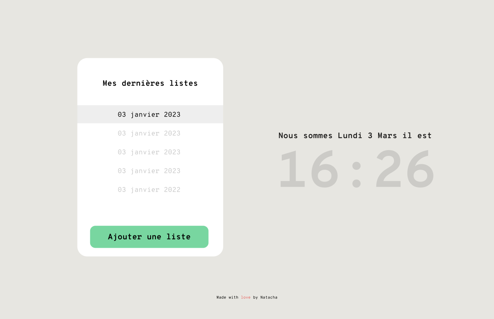

# Fun todo app in vanilla JS

I wanted to create a fun to-do app, unlike the others. I have an intern under my responsibility who is learning web development, and I wanted to give him a fun exercise. So what's better than to create it myself before giving it to him?

Design made by myself in Figma.

## Future features to develop

- Implement localstorage
- Implement list display
- Implement todo list
- Implement task form
- Implement (maybe) several languages (fr/en)
